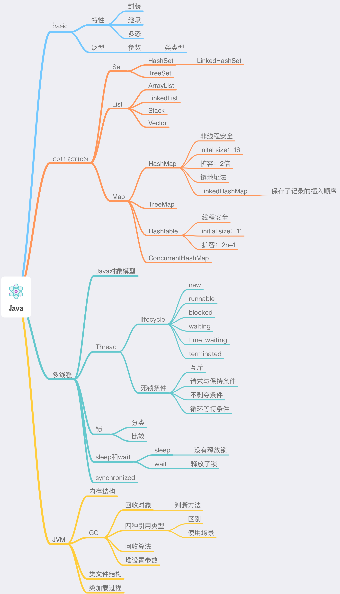
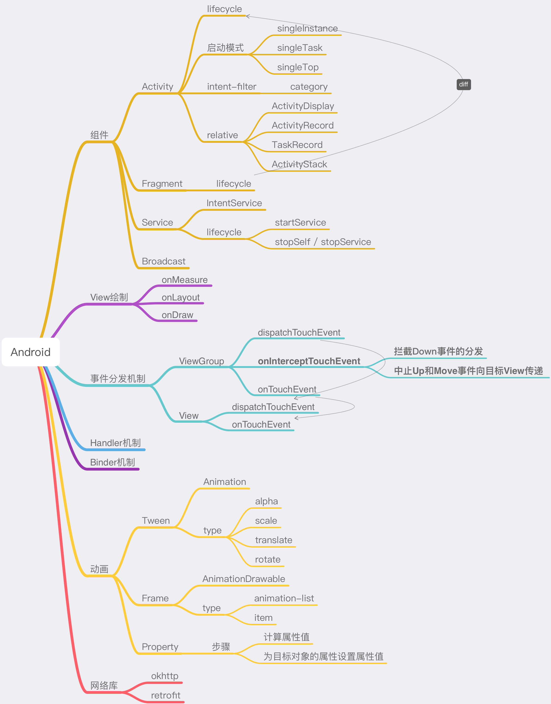

---

---

# ReviewNotes

建立自己的复习知识仓库，知识整理和笔记，不断完善。

# Java

总图

[JavaReview](https://github.com/imononoke/ReviewNotes/blob/master/Java/Java.md)

# Android

总图

# 数据结构 & 算法

## 数据结构

### 数组

### 链表

### Tree

#### 二叉树

## 算法

# Web

# 设计模式

